# Kodai

 Product Engineer in Tokyo, Japan · working at [Gaudiy](https://gaudiy.com)

```bash
npx kodai3 whoami
```

<p>
  
  
</p>

<!--
Stats cards are generated daily by `.github/workflows/update-readme-stats.yml`
(using stats-organization/github-readme-stats-action — successor to the
deprecated anuraghazra/github-readme-stats Vercel deploy).

Optional: set repository secret README_STATS_TOKEN to a classic PAT with
`repo` + `read:user` so `count_private=true` includes private contributions.
-->
